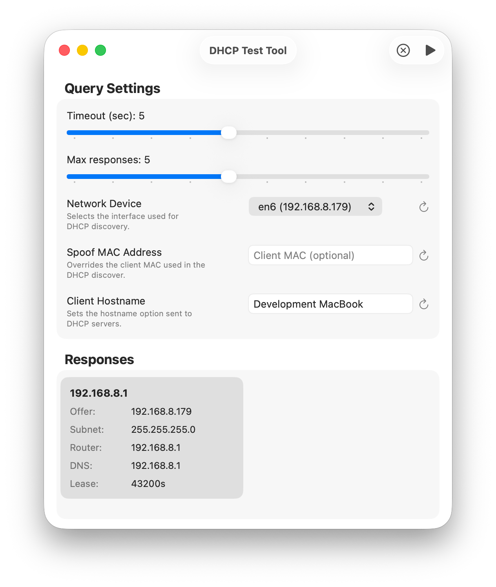

<div align="center">

<picture>
  <source srcset="Documentation/icon-dark.png" media="(prefers-color-scheme: dark)">
  <source srcset="Documentation/icon-light.png" media="(prefers-color-scheme: light)">
  
</picture>
<br/><br/>

macOS SwiftUI app for sending DHCP discover messages and listing responding DHCP servers.

</div>

## 🖥️ Screenshots 

<p align="center">
  
</p>

## Features
- Send DHCP discover and collect offers/acks.
- Select the active network device used for the query.
- Optional spoofed client MAC and hostname.
- MAC Address Generator.
- Shows offer details like subnet, router, DNS, lease time, and vendor.

## Requirements
- macOS 14.0

## Usage
1) Choose the network device to send the DHCP discover.
2) Optionally set a spoofed MAC address and/or hostname.
3) Click "Query DHCP Servers" (Play button in Toolbar) to listen for responses.

## ⚙️ Installation

Download from Releases. It's signed & notarized!

## ⚙️ Build it yourself!

Clone the repo and build with Xcode:

```bash
git clone https://github.com/gbabichev/DHCP-Test-Tool.git
cd DHCP-Test-Tool
open "DHCP Test Tool.xcodeproj"
```

## 📝 Changelog

### 1.0.0
- Initial Release